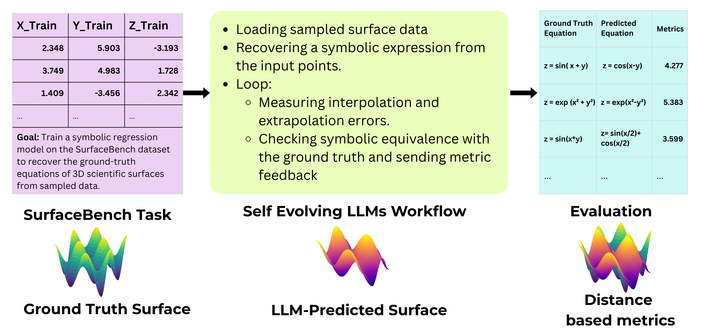

# `SurfaceBench`: Benchmark for 3D Scientific Surface Discovery 

[](https://huggingface.co/datasets/pandoradox/symbolic-regression-surfaces)

## Overview
In this paper, we introduce SurfaceBench, a benchmark built to push equation discovery beyond simple scalar functions and into the richer setting of symbolic surface recovery. The benchmark contains 183 tasks covering 15 different categories, each capturing a distinct kind of symbolic or geometric complexity. Every task provides a ground-truth surface equation along with variable meanings and a 3D point cloud sampled from it, spanning scientific areas such as fluid dynamics, robotics, electromagnetics, and classical geometry. Our goal is to challenge LLM-based symbolic regression systems in a way that existing datasets do not: the surfaces in SurfaceBench are constructed to avoid easy memorization, include diverse representation forms (explicit, implicit, parametric), and reflect realistic scientific structure.



## Get Started

### Installation

To run the code, create a conda environment and install the dependencies provided in the `requirements.txt` or `environment.yml`:

```
conda create -n SurfaceBench python=3.11.7
conda activate SurfaceBench
pip install -r requirements.txt
```

Note: Requires Python ≥ 3.9

You also need to install other packages for each search method from their original github repositories.
  - [OpenEvolve](https://github.com/algorithmicsuperintelligence/openevolve)
  - [LLM-SR](https://github.com/deep-symbolic-mathematics/LLM-SR)
  - [LaSR](https://github.com/trishullab/LibraryAugmentedSymbolicRegression.jl)
  - [SGA](https://github.com/PingchuanMa/SGA)
  - [PySR](https://github.com/MilesCranmer/PySR)


### Datasets

The data for the benchmark will be automatically downloaded from [huggingface](https://huggingface.co/datasets/pandoradox/symbolic-regression-surfaces).

### Supported methods

We provide implementation for [OpenEvolve](https://github.com/algorithmicsuperintelligence/openevolve) in the `OpenEvolve/` folder,  [LLMSR](https://github.com/deep-symbolic-mathematics/LLM-SR), [LaSR](https://github.com/trishullab/LibraryAugmentedSymbolicRegression.jl), [SGA](https://github.com/PingchuanMa/SGA), [PySR](https://github.com/MilesCranmer/PySR) in the `methods/` folder.

In order to include a new method, please refer to the implementation section for detailed instructions on how to add a new discovery method to the project. This includes setting up the necessary configurations, implementing the searcher class, and ensuring compatibility with the existing framework.

### How to run
1. Activate the appropriate conda environment.
2. Launch a local LLM server. While our implementation utilizes `vllm`, you can also opt for other libraries as long as you implement the necessary functionality in the searcher class. For example, to start the server with the vllm library, use the command:

```
vllm serve meta-llama/Llama-3.1-8B-Instruct --dtype auto --api-key token-abc123 --port 10005
```

3. Configure the environment variables in the `.env` file. Duplicate `.env.example` to `.env` and specify the following:
   - `VLLM_API_KEY`: Your API key for the local vLLM server (e.g., 'token-abc123').
   - `OPENAI_API_KEY`: Your OpenAI API key if you are utilizing OpenAI models.
   - `SGA_PYTHON_PATH`: The path to the Python executable in your SGA conda environment if you are using the SGA searcher.

4. Execute the [eval.py](./eval.py) script with the required arguments:
   - `--searcher_config`: Path to the YAML configuration file for the searcher (mandatory).
   - `--dataset`: The name of the dataset to evaluate (mandatory).
   - `--resume_from`: The path to a previous run directory to continue from (optional).
   - `--problem_name`: The specific problem name to evaluate (optional).
   - `--local_llm_port`: The port number for the local LLM server (optional).

   Available dataset options include:
   * `Non-Canonical 3D Geometric Surfaces` (Non-Canonical_3D_Geometric_Surfaces)

   * `Piecewise Regime Surfaces` (Piecewise_Regime_Surfaces)

   * `Symbolic–Numeric Composite Surfaces` (Symbolic–Numeric_Composite_Surfaces) 

   * `Hybrid Multi-Modal Symbolic Surfaces` (Hybrid_Multi-Modal_Symbolic_Surfaces) 
   
   * `Procedural & Fractal Surfaces` (Procedural_Fractal_Surfaces)

   * `Bio-Inspired Morphological Surfaces` (Bio-Inspired_Morphological_Surfaces)

   * `Complex Composite Surfaces` (Complex_Composite_Surfaces)

   * `Tensor Field Surfaces` (Tensor_Field_Surfaces)

   * `Discrete Symbolic Grid Surfaces` (Discrete_Symbolic_Grid_Surfaces)

   * `Non-Linear Dynamical System Surfaces` (Non-Linear_Dynamical_System_Surfaces)

   * `Quantum Inspired Surfaces` (Quantum_Inspired_Surfaces)

   * `Stochastic Process Surfaces` (Stochastic_Process_Surfaces)

   * `Surrogate-Distilled Symbolic Approximations` (Surrogate-Distilled_Symbolic_Approximations)

   * `Algebraic Manifolds of Higher Degree` (Algebraic_Manifolds_of_Higher_Degree)

   * `Transformed Coordinate Surfaces` (Transformed_Coordinate_Surfaces)

  
For example, for running discovery methods on all the `Tensor Field Surfaces` datasets with open LLM backbone `Qwen-3-8B` on local server, you can use the following commands:


LLM-SR:

```
python eval.py --dataset "Tensor_Field_Surfaces" --searcher_config configs/llmsr_qwen3-8B.yaml --local_llm_port 10005
```

LaSR:

```
python eval.py --dataset "Tensor_Field_Surfaces" --searcher_config configs/lasr_qwen3-8B.yaml --local_llm_port 10005
```

SGA method:

```
python eval.py --dataset "Tensor_Field_Surfaces" --searcher_config configs/sga_qwen3-8B.yaml --local_llm_port 10005
```

More evaluation scripts for running discovery methods with different LLM backbones on different datasets are provided in `example_script.sh`. 

The execution of [eval.py](./eval.py) will generate log files in the `logs/` folder. You can resume your run using the `--resume_from <log_dir>` option. For instance, 
`--resume_from logs/Tensor_Field_Surfaces/Tensor_Field_Surfaces/llmsr-Qwen3-8B/09-20-2025_18-09-19-121210` will bypass already completed problems.


### Project Structure
The working directory structure will be as follows:

```
project
│   README.md
|   eval.py
|   .env
└───bench/
|
└───methods/
|   └───llmsr
|   └───lasr
|   └───PySR
|   └───sga_sr
|
└───datasets/
|
└───OpenEvolve/
|
└───logs/
    └───<dataset-name>
        └───<method-name>
            └───<date>
```


## Implementing a new searcher

To implement a new searcher, you must create a class that inherits from the base class `BaseSearcher`. This base class provides the foundational structure for your LLM-based searcher, including essential methods that need to be overridden.

```python
class BaseSearcher:
    def __init__(self, name) -> None:
        self._name = name

    def discover(self, task: SEDTask) -> List[SearchResult]:
        '''
        Return:
            List of SearchResult
        '''
        raise NotImplementedError

    def __str__(self):
        return self._name
```

The input `task` will provide a description of the target equation, input variables, and training data points.

An example of a searcher is
```python
class NewSearcher(BaseSearcher):
    def __init__(self, name, num_sample, api_type, api_model, api_url):
        super().__init__(name)
        self.num_samples = num_samples
        self.llm = LLM(api_type, api_model, api_url)

    def discover(self, task: SEDTask):
        dataset = task.samples
        symbol_descs = task.symbol_descs

        prompt = f"Find the mathematical function skeleton that represents {symbol_descs[0]}, given data on {", ".join(symbol_descs[1:-1]) + ", and " + symbol_descs[-1]}"
        
        best_program, best_score = None, -np.inf
        for _ in range(self.num_samples):
            program_str, aux = self.llm.sample_program(prompt)
            score = evaluate(program_str, dataset)
            if score > best_score:
                best_program = program_str

        best_equation = Equation(
            symbols=info["symbols"],
            symbol_descs=info["symbol_descs"],
            symbol_properties=info["symbol_properties"],
            expression=None,
            program_format = best_program,
            lambda_format = programstr2lambda(best_program)
        )

        return [
            SearchResult(
                equation=best_equation,
                aux=aux
            )
        ]
```

Once you’ve implemented your searcher, create a corresponding configuration file in the `configs/` folder. For example:

```yaml
name: NewSearcher-Llama31_8b
class_name: NewSearcher
api_type: "vllm"
api_model: "meta-llama/Llama-3.1-8B-Instruct"
api_url: "http://localhost:{}/v1/"
num_samples: 1000
```

To evaluate with this searcher, run `eval.py` and provide the path to its corresponding configuration file; this will load the settings and initiate the evaluation process on the specified dataset.


## To Run OpenEvolve:

### 1. Configure API Keys

The API key is read from the environment `OPENAI_API_KEY` by default. You can check `create_config()` in `data_api.py`.


### 2. Load Benchmark Tasks & Generate Initial Programs

The `data_api.py` script is crucial for setting up the environment. It prepares tasks from the SurfaceBench dataset (defined by classes in `./bench`, and will be located at `./problems`).

For each benchmark task, this script will automatically generate:

- `initial_program.py`: A starting Python program, typically a simple linear model.
- `evaluator.py`: A tailored evaluation script for the task.
- `config.yaml`: An OpenEvolve configuration file specific to the task.

Run the script from your terminal:

```bash
python data_api.py
```

This will create subdirectories for each benchmark task, populated with the necessary files.

### 3. Run OpenEvolve

Use the provided shell script `scripts.sh` to execute OpenEvolve across the generated benchmark tasks. This script iterates through the task-specific configurations and applies the evolutionary process.

```bash
bash scripts.sh
```

### 4. Evaluate Results

After OpenEvolve has completed its runs, you can evaluate the performance on different subsets of tasks (e.g., bio, chemical, physics, material). The `eval.py` script collates the results and provides a summary.

```bash
python eval.py <subset_path>
```

For example, to evaluate results for the 'Tensor_Field_Surfaces' subset located in `./problems/Tensor_Field_Surfaces/`, you would run:

```bash
python eval.py ./problems/Tensor_Field_Surfaces
```

This script will also save a `JSON` file containing detailed results for your analysis.


## To Run PySR (Non-LLM Method):

```
python eval.py --dataset "Tensor_Field_Surfaces" --searcher_config configs/pysr_explicit.yaml
```


## License

This repository is licensed under MIT licence.

This work is built on top of other open source projects, including [Openevolve](https://github.com/algorithmicsuperintelligence/openevolve), [LLM-SR](https://github.com/deep-symbolic-mathematics/llm-sr), [LaSR](https://github.com/trishullab/LibraryAugmentedSymbolicRegression.jl), [SGA](https://github.com/PingchuanMa/SGA), and [PySR](https://github.com/MilesCranmer/PySR), and is inspired by the effort behind [LLM-SRBench](https://github.com/deep-symbolic-mathematics/llm-srbench/). We thank the original contributors of these works for open-sourcing their valuable source codes. 


## Contact Us

For any questions or issues, you are welcome to open an issue in this repo, or contact us at sanchit23@vt.edu and shobhnik1@gmail.com.